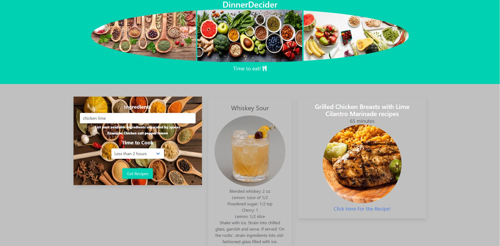

# DinnerDecider
User story:
A website that provides a user with a list of possible cooking recipies based on their inputs.

Here is a deployed website that has the ability to input ingredients that the user has, or a craving the user might have, and output a recipe based on those, as well as time allotted. 

This website was build using Bulma HTML framework, and JQuery Javascript library